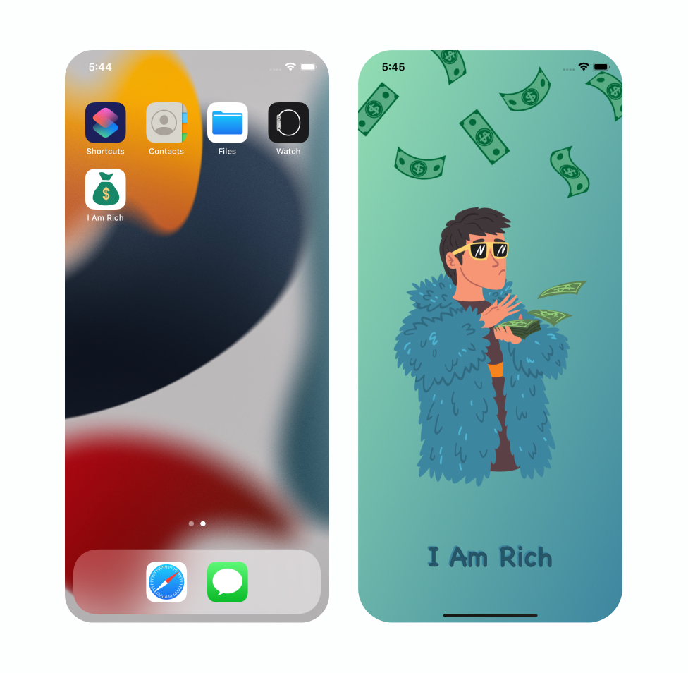

# I-Am-Rich iOS App

This is a simple one-page iOS app written in Swift 5 and designed with Storyboard. The app is mainly developed to practiced:
- CAGradientLayer class
- UIViewImage
- UIViewLabel
- Assets/AppIcon

<h3 align="center">

</h3>
